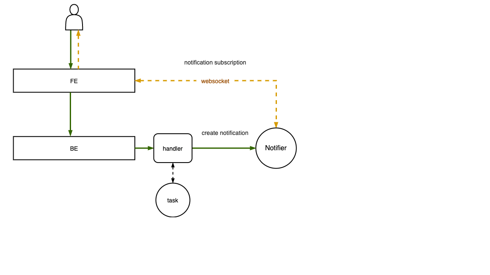

## Концепция

Единая точка хранения всех уведомлений по нескольким Web-сервисам и шлюз сообщений с возможностью отправки в разные каналы.
Сервисы подключаются через WebSocket к системе и получают уведомления в реальном времени + историю уведомлений клиента
Клиент может настраивать каналы для связи в каждом сервисе
Пользователь может проверять лог по отправке уведомлений + создавать уведомления вручную

## Функционал

- Создание уведомления
- Предоставление API методов для интеграции с другими сервисами
- Умение создавать уведомления из различных источников событий
- Отправка уведомлений в интерфейс и email

# Структура

Клиент-серверное приложение. Клиент отвечает за отображение данных и реакцию на действия пользователя, сервер предоставляет интерфейс для доступа к данным и бизнес-логике приложения.
В качестве клиента Web-приложение (Single Page Application - Vue.js)
На серверной части архитектура MVС (Node.js)
Доступ к базе использует паттерн Data Mapper и выполняется с помощью ORM (Prisma.io)

## БД

- Уведомление

  - ID
  - Дата публикации
  - Создатель уведомления
  - ID получателя
  - Ключ системы получателя
  - Текст уведомления
  - Тип уведомления
  - isRead

- Пользователь

  - Логин
  - Пароль
  - Имя
  - Email
  - ID роли

- Справочник ролей

  - ID
  - Нaзвaние

- Справочник систем

  - ID
  - Название
  - Ключ для связи

- Типы уведомления

  - ID
  - Название

- Настройка
  - ID
  - ID получателя
  - JSON с Ключами систем и массивом активных каналов связи

## Схема взаимодейтсвия

